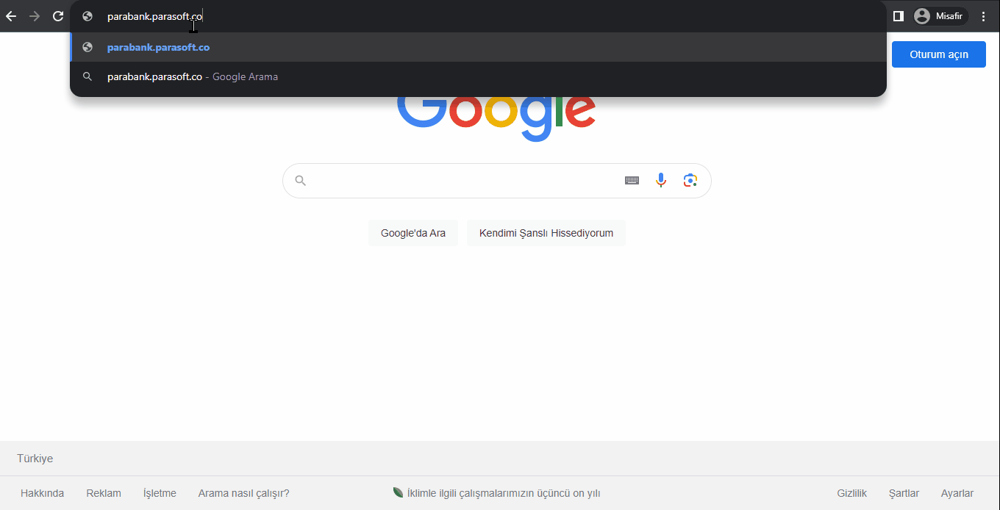
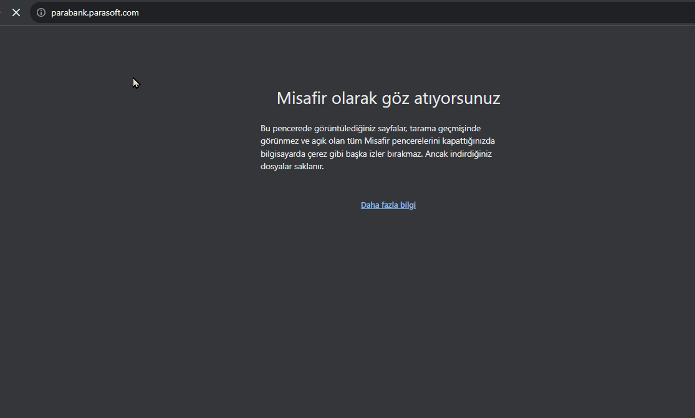
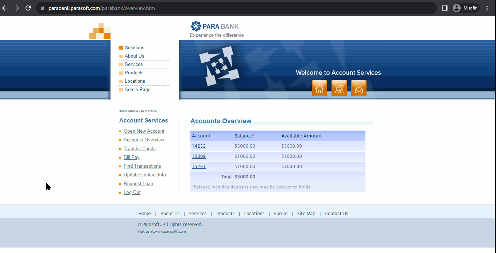
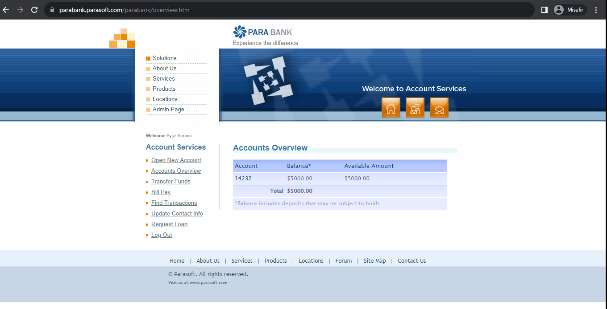
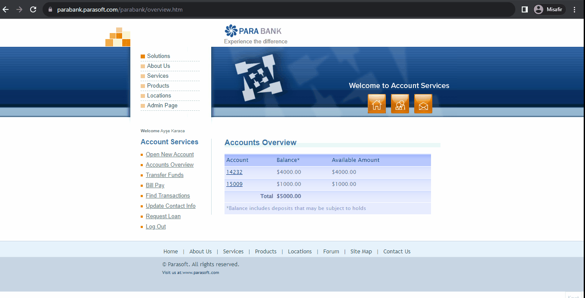

<h1 align="center">
  
</h1>

---

# 👩‍💻 Parasoft Agile Software Testing Project

    

---

# TECHNO STUDY Agile Software Testing Project - ParaBank

## 📌 Project Overview
Virtual banking application for testing financial transactions including account management, money transfers, and loan processing.  
**Primary URL**: [https://parabank.parasoft.com/](https://parabank.parasoft.com/)  
**Alternative URL**: [https://para.testar.org/](https://para.testar.org/)

## 🎯 Project Goals
- Functional UI test automation using Selenium/TestNG
- Weekly sprint-based development
- Skill development in:
- Technical: Java, Cucumber, Maven
- Soft Skills: Team collaboration, problem-solving
- Continuous improvement through iterative feedback

## 📋 Key User Stories
| ID    | Feature                          | Description                              |
|-------|----------------------------------|------------------------------------------|
| US601 | User Registration                | New user account creation                |
| US602 | User Login                       | Authentication system validation         |
| US603 | Bill Payment                     | Utility payment functionality testing    |
| US604 | Account Creation                 | Checking/savings account setup           |
| US605 | Transfers Funds                  | Internal money transfer verification     |
| US606 | Contact Info Update              | User profile management testing          |
| US607 | Loan Application                 | Credit request process validation        |

## 🛠️ Tech Stack
- **Test Automation**: Java, Selenium, TestNG, Cucumber
- **CI/CD**: Maven
- **Test Management**: Jira
- **Version Control**: GitHub

## 🛠️ Technologies Used

| Technology    | Version / Info            | 
|-------------- |---------------------------|
| ☕ JDK       | 17                        |
| 🌐 Selenium  | 4.x                       |
| 🧪 TestNG    | Latest Version            |
| 📂 GitHub    | Source Control            |
| 🗂️ Jira      | Project Management        |
| 🌍 Browsers  | Chrome, Firefox, Safari   |

# 🛠️ Technologies Used
| Technology       | Version   | Purpose                                  |
|-------------------|-----------|------------------------------------------|
|☕ Java JDK         | 17        | Core development language                |
|🌐Selenium         | 4.x       | Web UI automation                        |
|🧪TestNG           | Latest    | Test orchestration & reporting           |
|🥒Cucumber         | Latest    | BDD implementation                       |
|📦Maven            | -         | Dependency management                    |
|🗂️GitHub           | Source Control    |Version control & collaboration  |
|📂Jira         | Project Management  | User story tracking & defect management                       |
|🌍Browsers            | Chrome, Firefox, Safari        |                |
---

## 📌 Contributors

| Name                                                       | Role               |
|------------------------------------------------------------|--------------------|
| [Atilla Toros Avcı](https://github.com/AtillaTorosAvci)    | GitHub Manager / QA    |
| [Ömer Boncuk](https://github.com/OmerBoncuk)               | Jira Administrator / QA |
| [Diyar Ölmez](https://github.com/diyarolmezz)              | QA          |
| [Barış Saydam](https://github.com/BarisSaydam)             | QA             |
| [Erdem Özkan](https://github.com/ErdemOzkann)              | QA             |
| [Gamze Batmaz](https://github.com/GAMZE3845)               | QA             |

---

## 📁 Evidence Files (Manual Testing)

### US_601 — User Registration
[View GIF](US_601_Reg.gif)  

### US_602 — User Login
[View GIF](US_602_Login.gif)  

### US_602 — User Login(negative)
[View GIF](US_602_Login_Neg.gif)  

### US_603 — Bill Payment 
[View GIF](US_603_BillPayment.gif)  

### US_604 — Account Creation
[View GIF](US_604_NewAccount.gif)  

### US_604 — Account Creation2
[View GIF](US_604_NewAccount2.gif)  

### US_605 — Transfers Funds
[View GIF](US_605_TransferFunds.gif)  

### US_606 — Contact Info Update 
[View GIF](US_607_UpdateContact.gif)  

### US_607 — Loan Application  
[View GIF](US_608_Loan_Credit.gif)  

---

## 💬 Communication Platforms

- **RocketChat**
- **WhatsApp**

---

## ✨ Skills Highlighted

- Manual Testing 🔍
- Automated Testing 🧪
- Functional UI Testing 🖥️
- BDD Implementation 🥒
- CI/CD Integration 📦
- Bug Reporting 🐞  
- Agile Sprint Workflow 📈  
- Git & GitHub Collaboration 🔧  
- Negative Testing Scenarios ⚡  
- Test Documentation ✍️

---

📌 Note: This project is for educational and testing purposes only.
